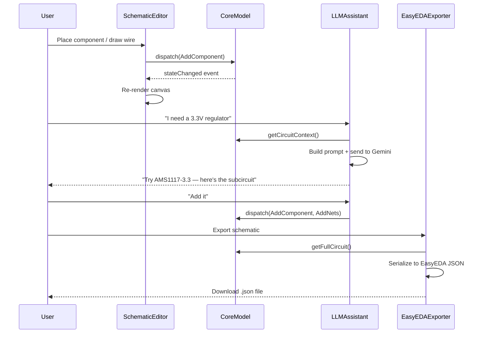

# Smart Circuit — Architecture

## Overview

Smart Circuit is a web-based electronic circuit design tool with an integrated LLM assistant. It supports schematic capture, component library management, PCB layout (stretch goal), and exports to the EasyEDA JSON format for final design review and gerber file generation.

---

## System Architecture

```
┌──────────────────────────────────────────────────────────────────┐
│                        Browser (SPA)                             │
│                                                                  │
│  ┌─────────────┐  ┌──────────────┐  ┌──────────────────────────┐│
│  │  Schematic   │  │   PCB Layout │  │   LLM Assistant Panel    ││
│  │   Editor     │  │   Editor     │  │   (Chat + Suggestions)   ││
│  │  (Canvas)    │  │  (Canvas)    │  │                          ││
│  └──────┬──────┘  └──────┬───────┘  └────────────┬─────────────┘│
│         │                │                        │              │
│  ┌──────┴────────────────┴────────────────────────┴─────────────┐│
│  │              Core Data Model (In-Memory Store)               ││
│  │  • Circuit graph (components, nets, pins)                    ││
│  │  • PCB layout (footprints, traces, layers)                   ││
│  │  • Component library cache                                   ││
│  └──────────────────────────┬───────────────────────────────────┘│
│                             │                                    │
│  ┌──────────────────────────┴───────────────────────────────────┐│
│  │                   Service Layer                              ││
│  │  • EasyEDA Exporter        • Project Serializer              ││
│  │  • DRC Engine              • Netlist Generator               ││
│  │  • Auto-Router (stretch)   • Undo/Redo Manager               ││
│  └──────────────────────────────────────────────────────────────┘│
└──────────────────────────────┬───────────────────────────────────┘
                               │ HTTP / WebSocket
┌──────────────────────────────┴───────────────────────────────────┐
│                        Backend Server                            │
│                                                                  │
│  ┌──────────────┐  ┌──────────────┐  ┌──────────────────────────┐│
│  │  LLM Proxy   │  │  Component   │  │  Project Storage         ││
│  │  (Gemini)    │  │  Search API  │  │  (File / DB)             ││
│  └──────────────┘  └──────────────┘  └──────────────────────────┘│
└──────────────────────────────────────────────────────────────────┘
```

## Technology Choices

| Layer | Technology | Rationale |
|-------|-----------|-----------|
| **Frontend framework** | Vite + vanilla TypeScript | Fast iteration, no heavy framework overhead for a canvas-centric app |
| **Schematic rendering** | HTML5 Canvas (via a thin 2D engine) | High performance for thousands of components; SVG overlay for UI elements |
| **State management** | Custom event-driven store | Circuit graph needs domain-specific operations (add net, move component) |
| **Backend** | Node.js + Express | Lightweight, same-language as frontend |
| **LLM integration** | Google Gemini API | User-specified; function-calling support for structured part suggestions |
| **Persistence** | File-based JSON (local) | Start simple; IndexedDB for browser-only mode; optional cloud later |
| **Export** | EasyEDA Standard JSON | JSON format with tilde-delimited shape strings; well-documented |

## Module Boundaries

Each module below has **its own directory** and **explicit public API** (an `index.ts` barrel export). Modules communicate through the core data model and an event bus — never by importing each other's internals.

### 1. `core/` — Data Model & Event Bus
- Circuit graph types: `Component`, `Pin`, `Net`, `Wire`, `Sheet`
- PCB types: `Footprint`, `Pad`, `Trace`, `Via`, `Layer`
- Event bus for cross-module communication
- Undo/redo command stack

### 2. `schematic/` — Schematic Editor
- Canvas renderer (zoom, pan, grid snapping)
- Interaction handlers (select, move, wire-draw, component place)
- Symbol rendering from component library definitions
- Electrical rule check (ERC) highlights

### 3. `pcb/` — PCB Layout Editor *(stretch)*
- Board outline, layer stack-up
- Footprint placement, trace routing
- Design rule check (DRC) engine
- Auto-router integration

### 4. `library/` — Component Library
- Component definitions (symbol + footprint + metadata)
- Built-in library of common parts
- Search & filter UI
- Import from external sources (LCSC, etc.)

### 5. `llm/` — LLM Integration
- Chat panel UI
- Prompt construction with circuit context
- Function-calling for structured actions (add component, suggest value)
- Streaming responses

### 6. `export/` — EasyEDA Export
- Schematic → EasyEDA Standard JSON serializer
- PCB → EasyEDA Standard JSON serializer
- Validation of exported files

### 7. `ui/` — Shared UI Components
- Toolbar, sidebar, property panel
- Dialog system, context menus
- Theme & layout management

### 8. `server/` — Backend
- LLM proxy (API key management, rate limiting)
- Component search API (wraps LCSC / Octopart / custom DB)
- Project save/load endpoints

## Key Data Flow



## File Structure (Proposed)

```
smart-circuit/
├── docs/                    # You are here
│   ├── ARCHITECTURE.md
│   ├── DATA_MODEL.md
│   ├── API_CONTRACTS.md
│   ├── EASYEDA_FORMAT.md
│   ├── LLM_INTEGRATION.md
│   ├── COMPONENT_LIBRARY.md
│   └── CONTRIBUTING.md
├── src/
│   ├── core/                # Data model, event bus, undo/redo
│   ├── schematic/           # Schematic editor canvas + interactions
│   ├── pcb/                 # PCB editor (stretch)
│   ├── library/             # Component library management
│   ├── llm/                 # LLM assistant integration
│   ├── export/              # EasyEDA exporter
│   ├── ui/                  # Shared UI components
│   ├── main.ts              # App entry point
│   └── index.html           # SPA shell
├── server/
│   ├── index.ts             # Express server entry
│   ├── routes/              # API route handlers
│   └── services/            # LLM proxy, component search
├── public/                  # Static assets, built-in symbols
├── tests/                   # Unit & integration tests
├── package.json
├── tsconfig.json
└── vite.config.ts
```

## Design Principles

1. **Offline-first** — The core editor works entirely in the browser. The server is only needed for LLM queries and component search.
2. **Data model is the source of truth** — All editors read from and write to the same `CircuitDocument`. No editor holds its own copy.
3. **Export fidelity** — The EasyEDA export must produce files that open without errors. We test round-trip: export → open in EasyEDA → verify.
4. **LLM as copilot, not driver** — The LLM suggests; the user confirms. All LLM actions go through the same command dispatch as manual edits.
5. **Incremental complexity** — Ship schematic editor + LLM + export first. PCB layout and auto-router are stretch goals.
